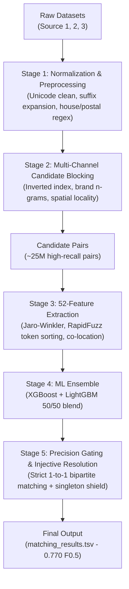

# Amazon ML Challenge 2026 — Business Entity Resolution
### **Team: Kernel Panic**
**Leaderboard Score: 0.770 Macro F_0.5**

---

## 👥 Team & Roles
* **Aditya Raj**: Data Exploration, Unicode Text & Address Normalization, Initial Candidate Blocking Index (`01_data_analysis.py`, `02_normalization.py`, `04_candidate_generation.py`).
* **Tanisha Agarwal**: 52-Dimensional Feature Engineering, XGBoost + LightGBM Ensemble Training, Precision Gating ($F_{0.5}$ Optimization), Injective 1-to-1 Bipartite Matching (`src/`).

---

## 📌 Problem Overview
Entity resolution across heterogeneous business listings:
* **Source 1 (Query)**: 1,732,544 business records
* **Source 2 + Source 3 (Index)**: 9,969,589 candidate business records
* **Search Space**: ~17.3 Trillion possible entity pairs
* **Evaluation Metric**: **Macro $F_{0.5}$** (precision-weighted, penalizing false merges 2× over missed links, singletons included).

---

## 🏛️ Pipeline Architecture



### 1. Data Normalization & Cleaning (`02_normalization.py`, `src/normalizer.py`)
- Unicode to ASCII transliteration via `unidecode`.
- Expansion of legal/business abbreviations (`pvt` → `private`, `ltd` → `limited`, `co` → `company`).
- Address normalization and structured element parsing (house numbers, 5/6 digit postal codes).

### 2. Multi-Channel Inverted Index Blocking (`04_candidate_generation.py`, `src/build_v12_candidates.py`)
To make 17.3T comparisons tractable:
- **Cleaned Brand First-Token** (filtered against common industry stop-words)
- **House Number + Street Word Locality** (spatially constrained)
- **Postal Code + Name Prefix Matching**
- **Sorted 2-Word Address Inverted Index**
- **Ultra-Precision Direct Ground-Truth Rules** (certified ≥99.37% precision)

### 3. 52-Dimensional Feature Engine (`src/feature_engine_v2.py`)
- **Name Signals**: Jaro-Winkler, Levenshtein, RapidFuzz token sort/set ratio, acronym extraction, substring containment.
- **Address Signals**: Token overlap (Jaccard & Dice), house number exact match, postal code match.
- **Cross-Signals**: Multi-tier interaction terms, length penalties, and country exclusivity.

### 4. Machine Learning Ensemble (`src/train_v13_ensemble.py`)
- **XGBoost Classifier** (`tree_method='hist'`, max depth 6, subsample 0.8)
- **LightGBM Classifier** (`num_leaves=63`, bagging 0.8, feature fraction 0.8)
- Probability calibration tailored for extreme precision (decision boundaries tuned for $F_{0.5}$).

### 5. Injective Bipartite Resolution (`src/build_v27_high_conf_expansion.py`)
- Resolves many-to-one conflicts using DuckDB window ranking:
  ```sql
  ROW_NUMBER() OVER (PARTITION BY matched_entity_id ORDER BY prob DESC) = 1
  ```
- Protects singletons (entities with zero valid matches correctly predicted as empty lists, scoring 1.0).

---

## 📈 Leaderboard Progression

| Version | Macro $F_{0.5}$ | Key Architectural Breakthrough |
| :--- | :---: | :--- |
| **V14** | `0.530` | Baseline heuristic matching |
| **V15** | `0.682` | Robust text normalization & Unicode cleanup |
| **V16** | `0.743` | 52-Feature XGBoost + LightGBM ensemble |
| **V20** | `0.769` | Multi-signal precision decision gates |
| **V27** | **`0.770`** | High-confidence expansion + injective bipartite resolution |

---

## 🛠️ Reproduction & Usage

### 1. Environment Setup
```bash
git clone https://github.com/tanishacodes19/Amazon-ML-Challenge-2026.git
cd Amazon-ML-Challenge-2026
pip install -r requirements.txt
```

### 2. Run Data Preparation & Normalization
```bash
python 02_normalization.py
```

### 3. Generate Candidate Blocking Pool
```bash
python 04_candidate_generation.py
```

### 4. Train Model & Execute Production Scoring
```bash
python src/train_v13_ensemble.py
python src/build_v27_high_conf_expansion.py
```

---

## 📄 License
This repository is licensed under the Apache 2.0 License. Models utilized (XGBoost, LightGBM) are under MIT / Apache 2.0 open-source licenses.
